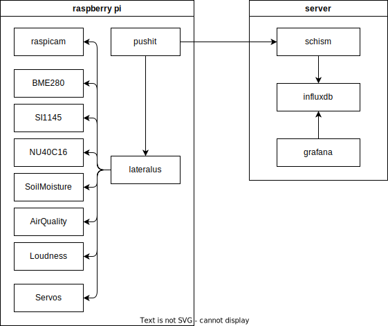

# Schism Framework Docs

## Components

- schism - backbone API that manages different devices and stores their sensor data in the influxdb
- influxdb - database that stores times series data
- grafana - visualizes the collected data
- lateralus (pi) - device backbone API that provides access to the device features (sensors, cameras, servos) implemented for the pi
- pushit (pi) - device schism client that scrapes the lateralus device backbone for data from its implemented features

## Development

- golang 1.16
- raspberry pi (3, 4, zero)
- direnv
- bob

## Configuration

### `.bob.yaml`

[bob](https://gitlab.void-ptr.org/go/bob) is a small helper program that makes the setup of multiple devices easier. With the .bob.yaml you can e.g. configure the target device for deploying or customize the build process. bob is used by lateralus and pushit, mostly in development to iterate on different devices (with differen features) - but it can also be used for a CI pileline or to deploy binaries to devices in a batch.

### `.lateralus.yaml`

Configures the active sensors, camera and servos for [lateralus](https://gitlab.void-ptr.org/go/lateralus) - you can check the config in the browser: <http://$raspberry:8080/?type=html>.

### `.pushit.yaml`

Configures the laterlus API and the schism API, also offers options to stop scraping certain features and the payload batch size of the [pushit](https://gitlab.void-ptr.org/go/pushit) client.

### `.env` files

The schism API and the required influxdb and grafana can be configured via the `.$ENVIRONMENT.env` files.
